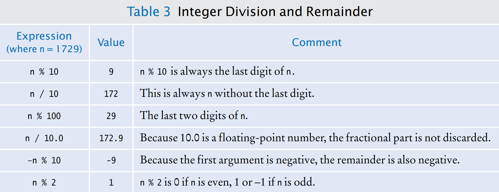

[Back to Big Java main](../../main.md)

# 4.2 Arithmetic
## 4.2.1 Arithmetic Operators
- Java supports the same four basic arithmetic operations as a calculator—addition, subtraction, multiplication, and division.
- The combination of variables, literals, operators, and/or method calls is called an **expression**.
- If you mix **integer** and **floating-point** values in an arithmetic expression, the result 
is a **floating-point** value.

<br>

## 4.2.2 Increment and Decrement
```java
int counter = 1;
counter++;
counter--;
```

<br>

## 4.2.3 Integer Division and Remainder
- Division
  - Division works as you would expect, as long as **at least one of the numbers involved is a floating-point number**.
    - e.g.)
      ```java
      7.0 / 4 // 1.75
      ```
  - If **both numbers are integers**, then the result of the integer division is always an 
  integer, with the **remainder discarded**.
    - e.g.)
      ```java
      7 / 4  // 1
      ```
- Modulus ```%```



<br>

## 4.2.4 Powers and Roots
- Power : ```Math.pow(x, n)``` $= x^n$
- Square Root : ```Math.sqrt(x)``` $= \sqrt{x}$

### Concept) Mathematical Methods
|Method|Returns|Method|Returns|
|-|-|-|-|
|Math.sqrt(x) |Square root of x (≥0) |Math.abs(x) |Absolute value \|x\||
|Math.pow(x, y) |xy (x > 0, or x = 0 and y > 0, or x < 0 and y is an integer)|Math.max(x, y)|The larger of x and y|
|Math.sin(x)| Sine of x (x in radians) |Math.min(x, y)| The smaller of x and y|
|Math.cos(x)| Cosine of x |Math.exp(x)| ex|
|Math.tan(x)| Tangent of x |Math.log(x)| Natural log (ln(x), x > 0)|
|Math.round(x)| Closest integer to x (as a long) |Math.log10(x)| Decimal log (log10 (x), x > 0)|
|Math.ceil(x)| Smallest integer ≥ x (as a double) |Math.floor(x)| Largest integer ≤ x (as a double)|
|Math.toRadians(x)| Convert x degrees to radians (i.e., returns x · π/ 180) |Math.toDegrees(x)| Convert x radians to degrees (i.e., returns x · 180/π)|

<br>

## 4.2.5 Converting Floating-Point Numbers to Integers
- You must use the **cast** operator (int) to convert a convert floating-point value to an integer.
  - e.g.)
    ```java
    double balance = total + tax;
    int dollars = (int) balance;
    ```
    ```java
    int dollars = (int) (total + tax);
    ```
- Rounding : ```Math.round()```


<br>

[Back to Big Java main](../../main.md)