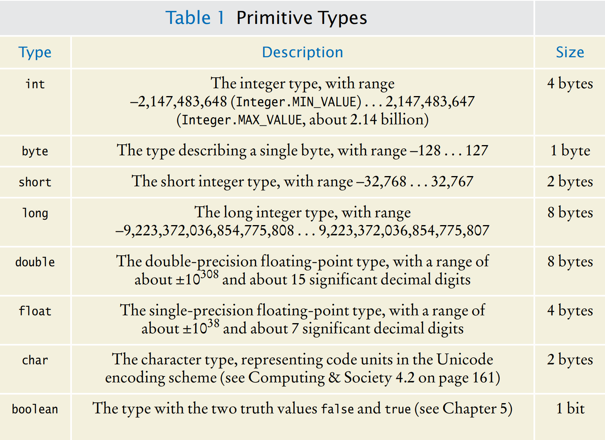

[Back to Big Java main](../../../main.md)

# 4.1 Numbers
## 4.1.1 Number Types
### Concept) Eight Primitive Types in Java

- cf)
  - ```Integer.MAX_VALUE```
  - ```Integer.MIN_VALUE```

<br>

### Concept) Number Literal
- Desc.)
  - When a value such as 6 or 0.335 occurs in a Java program, it is called a **number literal**.

### Concept) Overflow
- Desc.)
  - Calculations involving integers can overflow. 
  - This happens if the result of a computation exceeds the range for the number type.
- e.g.)
  ```java
  int n = 100000;
  System.out.println(n*n);
  ```
- cf.) How to use big number objects in Java
  - Use ```BigInteger``` or ```BigDecimal```.
  - Big number objects have essentially no limits on their size and precision.
  - However, computations with big number objects are much slower than those that involve number types.
  - Cannot use arithmetic operators : +, -, *, /
  - e.g.)
    ```java
    BigInteger n = new BigInteger("1000000");
    BigInteger r = n.multiply(n);
    System.out.println(r); // Prints 1000000000000
    ```
    ```java
    BigDecimal d = new BigDecimal("4.35");
    BigDecimal e = new BigDecimal("100");
    BigDecimal f = d.multiply(e);
    System.out.println(f); // Prints 435.00
    ```

### Concept) Limited Precision of Floating-Point Numbers
- Desc.)
  - The ```double``` type has about 15 significant digits
  - Thus, there are many numbers that cannot be accurately represented as double values.
  - When a value cannot be represented exactly, it is rounded to the nearest match.
- e.g.)
  ```java
  double f = 4.35;
  System.out.println(f*100);
  ```

### Prop.) Casting Rules in Java
- It is legal to assign an integer value to a floating-point variable.
  - e.g.)
    ```java
    int dollars = 100;
    double balance = dollars; // OK
    ```
- It is an error to assign a floating-point variable to an integer value.
  - e.g.)
    ```java
    double balance = 3.75;
    int dollars = balance; // Error
    ```

<br><br>

## 4.1.2 Constants
### Concept) Constants
- Desc.)
  - In Java, constants are identified with the reserved word ```final```.
  - A variable tagged as ```final``` can never change after it has been set. 
  - If you try to change the value of a ```final``` variable, the compiler will report an error and your program will not compile.
  - Many programmers use all-uppercase names for constants (```final``` variables).
- How to use)
  - Declared in a method
    - e.g.)
      ```java
      final double QUARTER_VALUE = 0.25;
      final double DIME_VALUE = 0.1;
      final double NICKEL_VALUE = 0.05;
      final double PENNY_VALUE = 0.01;

      payment = dollars + quarters * QUARTER_VALUE + dimes * DIME_VALUE  + nickels * NICKEL_VALUE + pennies * PENNY_VALUE;
      ```
  - Declared in a class
    - Declare constants together with the instance variables of a ```class``` and tag them as ```static``` and ```final```. 
      - e.g.)
        ```java
        public class CashRegister {
        // Constants
        public static final double QUARTER_VALUE = 0.25;
        public static final double DIME_VALUE = 0.1;
        public static final double NICKEL_VALUE = 0.05;
        public static final double PENNY_VALUE = 0.01;
        // Instance variables
        private double purchase;
        private double payment;
        // Methods
        . . . 
        }
        ```
      - e.g.) Java's ```Math``` class
        ```java
        public class Math {
         . . . 
         public static final double E = 2.7182818284590452354;
         public static final double PI = 3.14159265358979323846;
        }
        ```

<br>

[Back to Big Java main](../../../main.md)