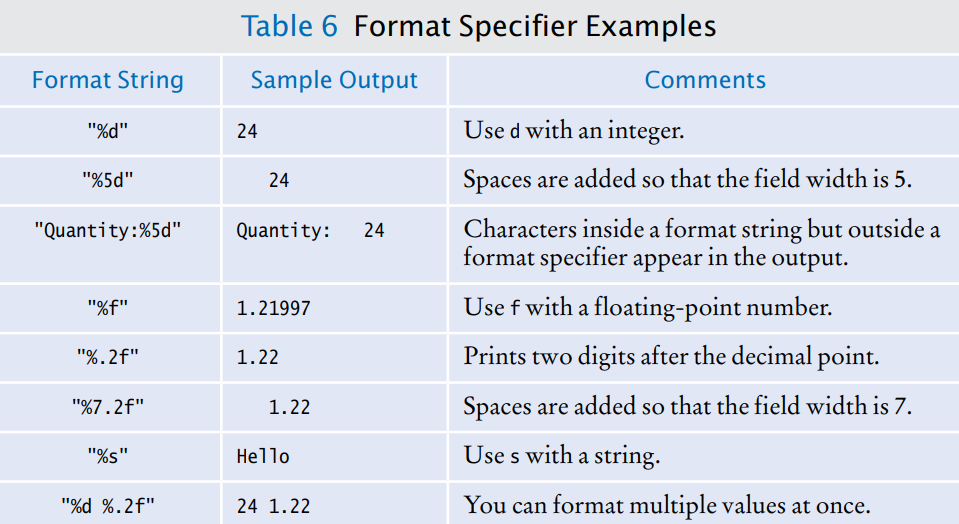

[Back to Big Java main](../../../main.md)

# 4.3 Input and Output
## 4.3.1 Reading Input
### Concept) Prompt
- Desc.)
  - A message that tells the user which input is expected

<br>

#### How to read user input)
- Use the ```Scanner``` class.
  - Not directly using the ```System.in``` object.
  - The ```Scanner``` class belongs to the package ```java.util```.
- e.g)
  ```java
  Scanner in = new Scanner(System.in);
  System.out.print("Please enter the number of bottles: ");
  int bottles = in.nextInt();
  ```

<br>

## 4.3.2 Formatted Output
### Concept) Decimal Format
- Syntax
  ```java
  System.out.printf("[FORMAT_SPECIFIER1] [FORMAT_SPECIFIER2]", VARIABLE1, VARIABLE2);
  ```
  - Format Specifier   
    


<br>

[Back to Big Java main](../../../main.md)