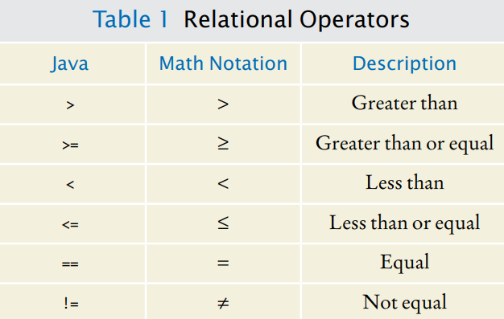

[Back to Big Java main](../../../main.md)

# 5.2 Comparing Values
## 5.2.1 Relational Operators


<br>

## 5.2.2 Comparing Floating-Point Numbers
- Prop.)
  - You have to be careful when comparing floating-point numbers in order to cope with round-off errors.
    - e.g.)
      ```java
      double r = Math.sqrt(2);
      double d = r * r -2;
      if (d == 0){
        System.out.println("sqrt(2) squared minus 2 is 0");
      } else {
        System.out.println("sqrt(2) squared minus 2 is not 0 but " + d);
      }
      ```
    - Sol.) Test whether they are close enough.
      - i.e.) $\mid x-y \mid \le \epsilon$
      - e.g.)
        ```java
        final double EPSILON = 1E-14;
        if (Math.abs(x-y) <= EPSILON){
            System.out.println("Yes");
        }
        ```

<br>

## 5.2.3 Comparing Strings
- Equality)
  - Use the ```equals``` method of the ```String``` class
    - e.g.)
      ```java
      String s1 = "abc";
      String s2 = "abc";
      if (s1.equals(s2)){
          System.out.println(s1);
      }
      ```

- Lexicographic Order)
  - Use the ```compareTo``` method of the ```String``` class
    - e.g.)
      ```java
      String s1 = "abc";
      String s2 = "abd";
      if (s1.compareTo(s2) < 0){            // s1 comes before s2.
          System.out.println(s1);
      } else if (s1.compareTo(s2) > 0 ){    // s1 comes after s2.
          System.out.println(s1);
      } else{                               // s1 and s2 are equal.
          null;
      }
      ```

<br>

## 5.2.4 Comparing Objects
- Comparing Object References
  - e.g.)
    ```java
    Rectangle box1 = new Rectangle(5, 10, 20, 30);
    Rectangle box2 = box1;
    Rectangle box3 = new Rectangle(5, 10, 20, 30);

    System.out.println(box1 == box2);
    System.out.println(box1 == box3);
    ```

<br>

## 5.2.5 Testing for ```null```
### Concept) ```null```
- Desc.)
  - An object reference can have the special value null if it refers to no object at all. 
  - It is common to use the null value to indicate that a value has never been set.
  - Note that the ```null``` reference is not the same as the empty string ```""```.


<br>

[Back to Big Java main](../../../main.md)