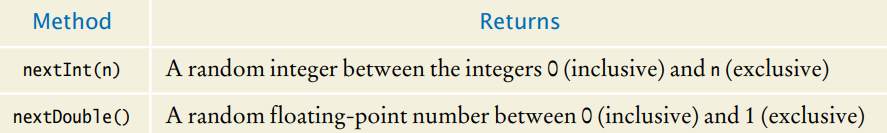

[Back to Big Java main](../../../main.md)

# 6.9 Application: Random Numbers and Simulations
### Concept) The Random Class
- The ```Random``` class of the Java library implements a random number generator that produces numbers that appear to be completely random.
- Syntax)
  - Instantiation)
    ```java
    import java.util.Random;

    Random gen = new Random();
    ```
  - Methods)     
    
- e.g.)
  - [Die Example](DieSimulator.java)
  - [Monte Carlo]()


<br>

[Back to Big Java main](../../../main.md)