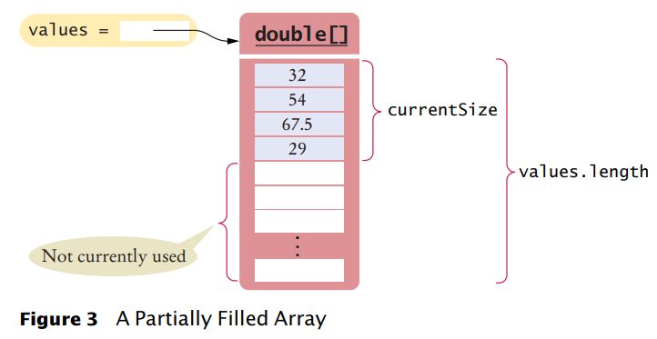

[Back to Big Java main](../../main.md)

# 7.1 Arrays
### Concept) Array
- Syntax)
  - e.g.) ```double``` array   
    ```java
    double[] doubleArray = {1.0,2.0,3.0,4.0,5.0};
    ```
    ```java
    double[] doubleArray = new double[10]
    for (int i=0; i<10; i++){
        doubleArray[i] = (double) i;
    }
    ```

<br>

#### Concept) Array Reference
  - Assigning and referencing values
    ```java
    int[] scores = new int[3];
    scores[1] = 10;
    System.out.println(scores[1]);
    ```

<br>

#### Concept) Using Arrays with Methods
  - Input Parameter of a function
    - e.g.)
      ```java
      public void addScores(int[] values){
        for (int i=0; i<values.length; i++){
          totalScore += values[i];
        }
      }
      ```

<br>

#### Concept) Partially Filled Array


<br>

[Back to Big Java main](../../main.md)