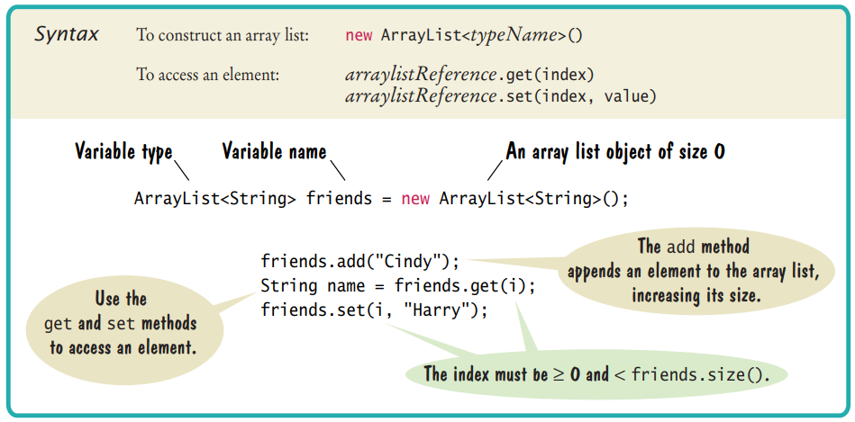

[Back to Big Java main](../../../main.md)

# 7.7 Array Lists
### Concept) Array Lists
- Syntax)   
  
- Desc.)
  - Array lists can grow and shrink as needed.
  - The ```ArrayList``` class supplies methods for common tasks, such as inserting and removing elements.
  - ArrayList is called a generic class.
    - Why?)
      - Consider the case below.
        ```java
        ArrayList<String> names = new ArrayList<String>();
        ```
      - The angle brackets around the ```String``` type tell you that ```String``` is a **type parameter**.
      - You can replace ```String``` with any other class and get a different array list type.
  - Primitive data types cannot be used as type parameters.
    - e.g.) ```int```, ```double``` cannot be used as type parameters.
    - Instead, use the [wrapper class](#concept-wrapper-class).
- Methods)
  - ```add``` : Add an element to the end of the array list. 
    - e.g.)
      ```java
      names.add("Emily");
      ```
  - ```get``` : Obtain an array list element.
    - e.g.)
      ```java
      String name = names.get(0);
      ```
  - ```set``` : Set an array list element to a new value.
    - e.g.)
      ```java
      names.set(0, "Carolyn");
      ```
  - ```remove``` : Remove an element at a position.
    - e.g.)
      ```java
      names.remove(0);
      ```
- Using the Enhanced ```for``` loop.
  - e.g.)
   ```java
   for (String name : names){
      System.out.println(name);
   }
   ```
- Copying Array Lists
  - e.g.)
   ```java
   ArrayList<String> newNames = new ArrayList<String>(names);
   ```

<br>

### Concept) Wrapper Class
|Primitive Type|Wrapper Class|
|:-:|:-:|
|```byte```|```Byte```|
|```boolean```|```Boolean```|
|```char```|```Character```|
|```double```|```Double```|
|```float```|```Float```|
|```int```|```Integer```|
|```long```|```Long```|
|```short```|```Short```|

<br>

### Concept) Auto-Boxing
- Automatic conversion between primitive types and the corresponding wrapper classes

<br>

### Concept) The Diamond Syntax
- e.g.)
  ```java
  ArrayList<String> names = new ArrayList<>();
  ```
  - Instead of 
    ```java
    ArrayList<String> names = new ArrayList<String>();
    ```

<br>

[Back to Big Java main](../../../main.md)