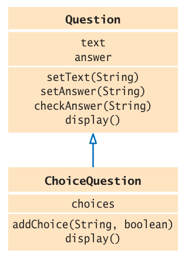

[Back to Big Java main](../../../main.md)

# 9.2 Implementing Subclasses
### Concept) How to form a subclass.
- Objects)
  - [Question](../../../src/ch_09/objects/Question/Question.java) : the super class
  - [ChoiceQuestion](../../../src/ch_09/objects/Question/Question.java) : the super class
  - To-be UML Diagram   
    
- Props.)
  - The `private` instance variables of the superclass are inaccessible.
    - Only the superclass has access to them.
    - The `ChoiceQuestion` methods cannot directly access the instance variable answer. 
    - These methods must use the public interface of the `Question` class to access its private data, just like every other method.

 

[Back to Big Java main](../../../main.md)