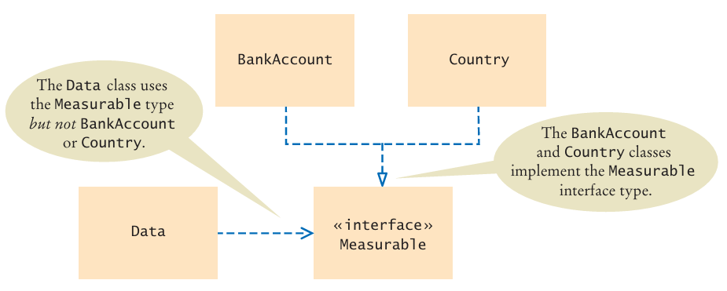

[Back to Big Java main](../../../main.md)

# 10.1 Using Interfaces for Algorithm Reuse

<br>

## 10.1.1) Discovering an Interface Type
### E.g.) Implementing an Average Computing Service
- Consider the example that the algorithm for computing the average is the same in all cases, but the details of measurement differ.
- e.g.)
  - `BankAccount`
    ```java
    public static double average(BankAccount[] objects){
        double sum = 0;
        if (objects.length == 0) return 0;

        for (BankAccount obj: objects){
            sum += obj.getBalance();
        }
        return sum / objects.length;
    }
    ```
  - `Country`
    ```java
    public static double average(Country[] objects){
        double sum = 0;
        if (objects.length == 0) return 0;

        for (BankAccount obj: objects){
            sum += obj.getArea();
        }
        return sum / objects.length;
    }
    ```
- Possible Solution)
  - Implementing a common method `getMeasure()` both on `BankAccount` and `Country`.
    - Will not work.
      - In Java, we also must declare the type of the variable `obj`.
      - Thus, we need a new type called the [interface type]().

<br><br>

## 10.1.2) Declaring an Interface Type
### Concept) Interface Type
- Desc.)
  - In Java, an `interface` type is used to specify required operations. 
  - The declaration is similar to the declaration of a class.
    - List the methods that the `interface` requires.
    - Don't have to supply an implementation for the methods.
  - Props.)
    - An `interface` type does not have instance variables. 
    - Methods in an `interface` must be *abstract* (that is, without an implementation) or as of Java 8, `static`, or `default` methods (see Java 8 Note 10.1 and Java 8 Note 10.2).
    - All methods in an `interface` type are automatically `public`.
    - An `interface` type has no constructor. Interfaces are not classes, and you cannot construct objects of an interface type.
- e.g.)
  ```java
  public interface Measurable{
    double getMeasure();
  }
  ```
  - Desc.)
    - The `Measurable` interface type requires a single method, `getMeasure`.
    - The corresponding [`average`](#eg-implementing-an-average-computing-service) method can be implemented as follows.
      ```java
      public static double average(Measurable[] objects){
        double sum = 0;
        if (objects.length == 0) return 0;

        for (Measurable obj: objects){
          sum += obj.getMeasure();
        }
        return sum / objects.length;
      }
      ```
    - A `class` implements an interface type if it declares the `interface` in an implements clause.
      - Refer to [10.1.3 Implementing an Interface Type](#1013-implementing-an-interface-type).

<br><br>

## 10.1.3 Implementing an Interface Type
A `class` implements an interface type if it declares the `interface` in an implements clause.
- e.g.)
  ```java
  public class BankAccount implements Measurable{
    public double getMeasure(){
      return this.balance;
    }
  }
  ```
  - Prop.)
    - Once the `BankAccount` class implements the `Measurable` interface type, `BankAccount` objects are instances of the `Measurable` type
      - i.e.)
        ```java
        Measurable obj = new BankAccount(); // OK!
        ```

<br>

#### E.g.) Data, Measurable, BankAccount, and Country
- Structure   
  
- Objects
  - [Data](../../../src/ch_10/objects/Measurable/Data.java)
  - [Measurable](../../../src/ch_10/objects/Measurable/Measurable.java)
  - [BankAccount](../../../src/ch_10/objects/Measurable/BankAccount.java)
  - [Country](../../../src/ch_10/objects/Measurable/Country.java)
- Test
  - [MeasurableTest](../../../src/ch_10/objects/Measurable/MeasurableTest.java)

<br>

### Concept) Default Methods
- Def.)
  - A default method is a nonstatic method in an interface that has an implementation.
- e.g.)
  - [Measurable](../../../src/ch_10/objects/Measurable/Measurable.java)'s `getMeasure` method.
    - It returns 0 as default.


<br>

[Back to Big Java main](../../../main.md)