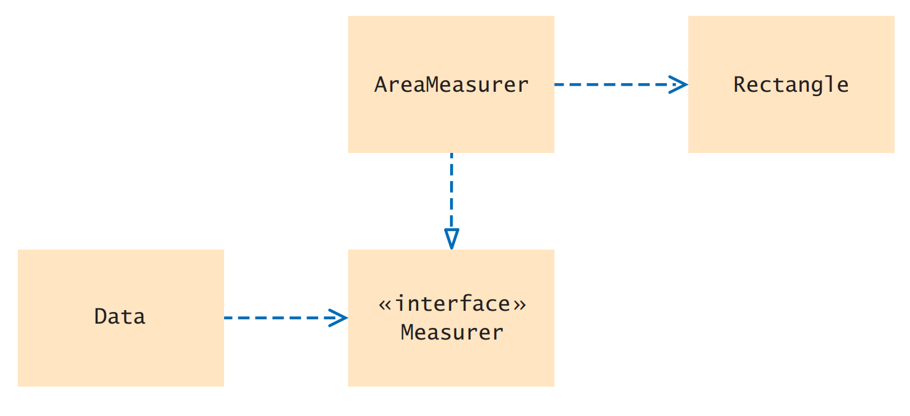

[Back to Big Java main](../../../main.md)

# 10.4 Using Interfaces for Callbacks
### Concept) Callback
- Desc.)
  - A **callback** is a mechanism for bundling up a block of code so that it can be invoked at a later time.
  - In Java, callbacks are turned into objects.
  - Why needed?)
    - Consider the standard libraries that we cannot edit.
    - There maybe cases that we need them to implement some interface types.
      - e.g.) `java.awt.Rectangle`
        - What if we want to define the average of `Rectangle` as the average value of the areas of the `Rectangle` objects?
          - Sol.) Callback!
- e.g.) Measurer and Average Area    
  
  - [Measurer](../../../src/ch_10/objects/Measurer/Measurer.java) `interface`
    - The measure method measures an object and returns its measurement.
    - Here we use the fact that all objects can be converted to the type `Object`.
  - The `average` method in [Data](../../../src/ch_10/objects/Measurer/AverageTest.java)
    - The code that makes the call to the **callback** receives an object of a class that implements this interface.
    - Use the `static` method!
  - [AreaMeasurer](../../../src/ch_10/objects/Measurer/AreaMeasurer.java)
    - Finally, a specific callback is obtained by implementing the `Measurer` interface.
  - Test on [AverageTest](../../../src/ch_10/objects/Measurer/AverageTest.java).

<br><br>

### Concept) Lambda Expression
- Desc.)
  - Simpler version of the [Callback](#concept-callback) mechanism
    - Recall that implementing the Callback mechanism is complex.
    - Instead, Java 8 provides Lambda Expression which is a convenient shortcut for this ,provided that the interface has a *single abstract method*.
      - Such an interface is called a **functional interface** because its purpose is to define a single function. 
        - e.g.) [Measurer](../../../src/ch_10/objects/Measurer/Measurer.java) `interface`
    - To specify that single function, you can use a **lambda expression**, an expression that defines the parameters and return value of a method in a compact notation.
      - e.g.)
        ```java
        Measurer accountMeas = (Object obj) -> ((BankAccount) obj).getBalance();
        ```
    - Now the following actions occur:
      1. A class is defined that implements the functional interface. The single abstract method is defined by the lambda expression.
      2. An object of that class is constructed.
      3. The variable is assigned a reference to that object.
    - In its simplest form, a lambda expression contains a list of parameters and the expression that is being computed from the parameters.
      - e.g.)
        ```java
        Measurer areaMeas = (Object obj) -> {
            Rectangle r = (Rectangle) obj;
            return r.getWidth() * r.getHeight();
        }
        ```

<br><br>

### Concept) Generic Interface Types
- Consider the `Comparable` interface type.
  ```java
  public interface Comparable<T>{
    int compareTo(T other)
  }
  ```
  - You need not use a cast to convert an Object parameter variable into the desired type.


<br>

[Back to Big Java main](../../../main.md)